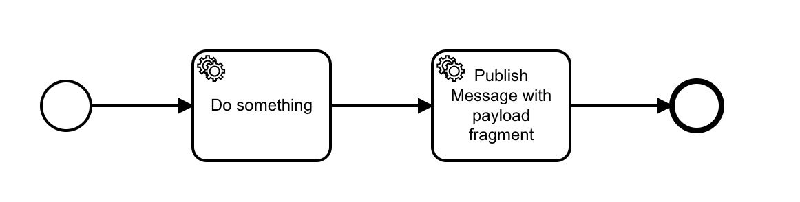
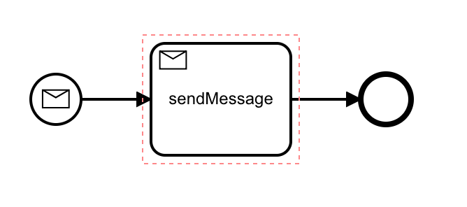

# Zeebe Kafka demo

A demo of Zeebe-Kafka integration.

In [a blog post last year](https://zeebe.io/blog/2018/12/writing-an-apache-kafka-connector-for-zeebe/), Bernd showed how to implement a Kafka connector for Zeebe.

Recently, in the [Zeebe Slack](https://zeebe-slack-invite.herokuapp.com/), a user wanted to know how to constrain the variables being sent to Kafka.

Bernd's POC implementation sends the entire variable scope to Kafka - and in fact the code explicitly leaves constraining the payload as an exercise for the reader:

## Approaches that don't work

@TODO

## An approach using a distinct workflow

@TODO

One of the great things about BPMN and Zeebe is that there is always more than one way to accomplish something, and although Zeebe doesn't have all the bells and whistles that Camunda does, it _does_ have a powerful set of primitives that - with enough creativity - can get the job done.

## An approach by modifying the connector code

I wrote a patch for the connector that allows you to specify which variables to send via a custom header on the "sendMessage" task instance.

See: [https://github.com/berndruecker/kafka-connect-zeebe/pull/2](https://github.com/berndruecker/kafka-connect-zeebe/pull/2)

@TODO
